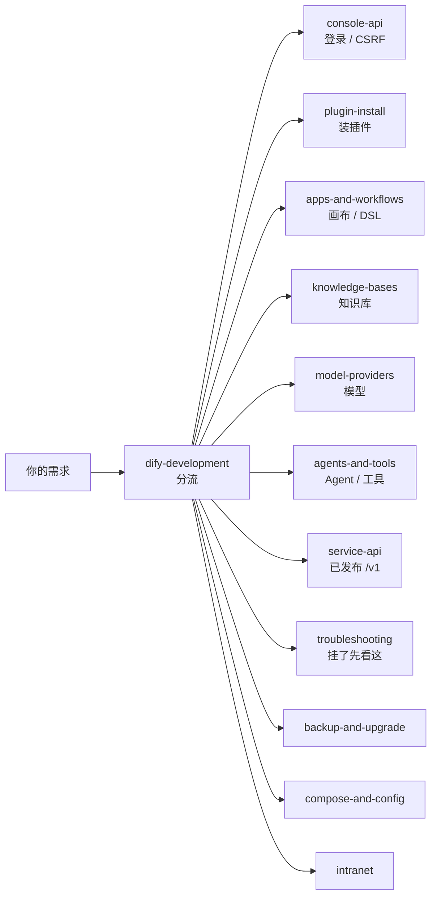
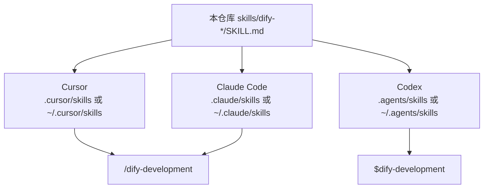
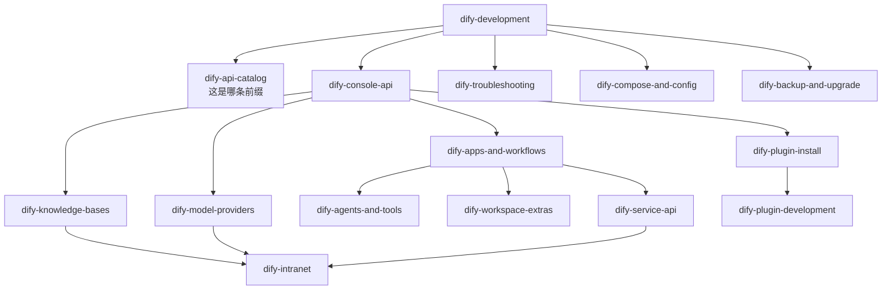
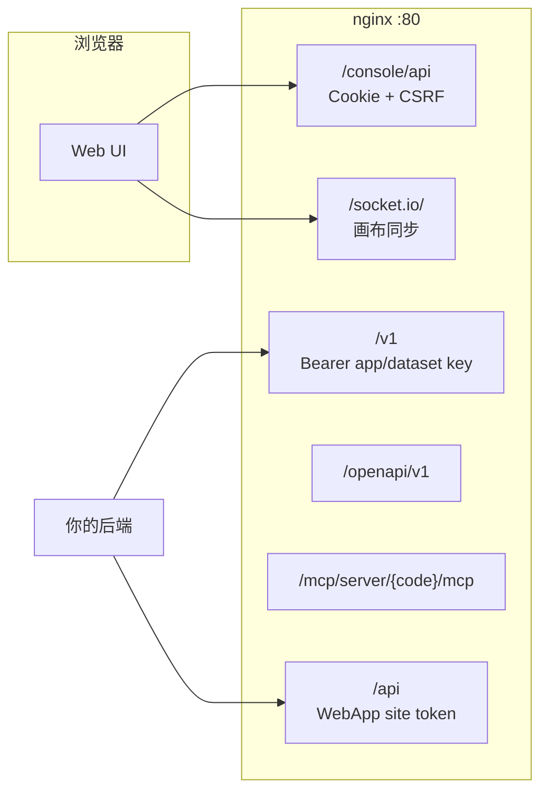

# Dify Operating Skills

[](https://github.com/langgenius/dify)
[](CHANGELOG.md)
[](LICENSE)
[](https://agentskills.io)

给编码助手用的 **自托管 Dify 操作技能**：真实 HTTP、鉴权、payload、失败模式。助手按菜单做，不要自己编路由。

当前跟踪 **Dify 1.17.0 Community**。`main` 是最新线，稳定 GitHub Release 还没有打。

> 这不是 Dify 控制台里的「工作区 Skills」。那些是给 *Dify Agent* 用的；这套是给 *Cursor / Claude Code / Codex* 用的。

English: executable [Agent Skills](https://agentskills.io) for operating self-hosted [Dify](https://github.com/langgenius/dify). Skills are English runbooks; this README is Chinese-first.

---

## 解决什么问题

自托管 Dify 的坑大多不在「点哪个按钮」，而在 **前缀、鉴权、compose 注入、画布 DSL、Service API 的 user 作用域**。这套技能把这些写成助手可执行的步骤。

| 你碰到的现象 | 真正原因 | 用哪个 skill |
| --- | --- | --- |
| 登录 `401 Invalid encrypted data` | 密码要 **Base64**，不是 RSA / 明文 | [dify-console-api](skills/dify-console-api/SKILL.md) |
| `401 CSRF` / 一小时后又挂 | Cookie 没有 `X-CSRF-Token`（**GET 也要**），或 session 过期 | [dify-console-api](skills/dify-console-api/SKILL.md) |
| 登录后首页 307 | 1.17 未登录跳 `/signin`，不是装坏了 | [dify-console-api](skills/dify-console-api/SKILL.md) |
| Web SSR “Server console API URL is not configured” | web 缺 `SERVER_CONSOLE_API_URL=http://api:5001` | [dify-compose-and-config](skills/dify-compose-and-config/SKILL.md) |
| nginx 502 `host not found in upstream api_websocket` | websocket 停着就 reload 了 nginx | [dify-troubleshooting](skills/dify-troubleshooting/SKILL.md) |
| `GET /apps` 少了一个 Agent | Agent Studio 在 `GET /agent` | [dify-console-api](skills/dify-console-api/SKILL.md) |
| 改了画布演示还是旧图 | `/v1` 跑的是 **published** | [dify-apps-and-workflows](skills/dify-apps-and-workflows/SKILL.md) |
| 文本 PDF 应用画布上还有 OCR | 文本版和 OCR 版必须拆成两个应用 | [dify-apps-and-workflows](skills/dify-apps-and-workflows/SKILL.md) |
| 改了 `.env` 容器里看不到 | 运行态才是真相：官方 1.17 走 `env_file`；定制 compose 常 **列出** `environment:` 或 bind-mount nginx/squid | [dify-compose-and-config](skills/dify-compose-and-config/SKILL.md) |
| 新盒子要「调到最佳」 | 平台 compose/超时/上传/SSRF/worker，**不是**导入自建工具 | [dify-development](skills/dify-development/SKILL.md) 一节「新环境：Dify 平台基础配置」 |
| 长工作流 6 分钟被杀 | `GUNICORN_TIMEOUT` 仍 360，或 nginx 3600s | [dify-compose-and-config](skills/dify-compose-and-config/SKILL.md) |
| Celery 把 CPU 打满、模型变慢 | `CELERY_AUTO_SCALE` 未注入 `MAX_WORKERS`，扩到 nproc | [dify-compose-and-config](skills/dify-compose-and-config/SKILL.md) |
| 上传 PDF 413 | nginx `client_max_body_size` 小于 Dify `UPLOAD_*` | [dify-compose-and-config](skills/dify-compose-and-config/SKILL.md) |
| 重建 api 后 nginx `502` | 上游 IP 缓存，要 `nginx -s reload` | [dify-troubleshooting](skills/dify-troubleshooting/SKILL.md) |
| 画布一直「同步数据中」 | 1.16+ 走 Socket.IO `/socket.io/`，`NEXT_PUBLIC_SOCKET_URL` 必须浏览器能访问 | [dify-troubleshooting](skills/dify-troubleshooting/SKILL.md) |
| `POST .../workflows/draft` 400 `environment_variables extra_forbidden` | 1.17 图同步不再收顶层 env 列表 | [dify-apps-and-workflows](skills/dify-apps-and-workflows/SKILL.md) |
| React error #130 | DSL 节点缺顶层 `type: "custom"` | [dify-apps-and-workflows](skills/dify-apps-and-workflows/SKILL.md) |
| `Invalid upload file` | `/v1` 上传和运行必须同一 API key + 同一稳定 `user` | [dify-service-api](skills/dify-service-api/SKILL.md) |
| 外挂知识库 404 / 召回全被滤掉 | RAGFlow 端点要带 `/dify`；那条路径没有 rerank，阈值要关 | [dify-knowledge-bases](skills/dify-knowledge-bases/SKILL.md) |
| 插件 uv `exit status 1` | 容器没外网，要用 host `.difypkg` + 本地 PEP 503 | [dify-plugin-install](skills/dify-plugin-install/SKILL.md) |
| 工具 `Unknown error` | `tool_name` 必须是 OpenAPI `operationId`，不是显示名 | [dify-agents-and-tools](skills/dify-agents-and-tools/SKILL.md) |
| 每个图都拖 MinerU / OCR 空结果 | 应做成可复用 Workflow 再发布为工具；插件不轮询异步 `/file_parse` | [dify-agents-and-tools](skills/dify-agents-and-tools/SKILL.md) |
| Webhook 404 / 定时不跑 | 公网路径是 `/triggers/webhook/{id}`；schedule 靠 worker_beat poller | [dify-apps-and-workflows](skills/dify-apps-and-workflows/SKILL.md) |
| 文件 start 上加了定时节点 publish 失败 | `start` 与 Trigger 不能同图；解析和每日扫描拆两个应用 | [dify-apps-and-workflows](skills/dify-apps-and-workflows/SKILL.md) |
| `/rbac` `/billing` 403 | 社区版功能开关，不是 CSRF 坏了 | [dify-development](skills/dify-development/SKILL.md) |
| 内网 HTTP / RAGFlow 502 | Squid SSRF，把内网主机加进 `NO_PROXY`；`SSRF_PROXY_ALLOW_PRIVATE_IPS` 是 CIDR 不是 `true` | [dify-intranet](skills/dify-intranet/SKILL.md) |
| 改了 `.env` 画布 Loop 上限不变 | 1.17 要 recreate **web**；运行时限额在 api `WORKFLOW_MAX_*` | [dify-compose-and-config](skills/dify-compose-and-config/SKILL.md) |
| 邀请邮件发不出去 | Dify 自己的 `MAIL_TYPE=smtp`，不是 email 插件 | [dify-compose-and-config](skills/dify-compose-and-config/SKILL.md) |
| 代码节点 15s 被杀 | `SANDBOX_WORKER_TIMEOUT`，不是「sleep ≤ 2s」 | [dify-apps-and-workflows](skills/dify-apps-and-workflows/SKILL.md) |
| 知识库 hit-test 空 | 外挂要 `/dify`；rerank 四个字段；关 score_threshold | [dify-knowledge-bases](skills/dify-knowledge-bases/SKILL.md) |



助手只加载技能的 `name` + `description`；匹配上了才读全文。所以 **从 [dify-development](skills/dify-development/SKILL.md) 进**，不要一次塞全部正文。

---

## 仓库结构

```
dify-skills/
├── skills/
│   ├── dify-development/SKILL.md      ← 入口 / 分流
│   ├── dify-api-catalog/SKILL.md
│   └── dify-…/SKILL.md
├── scripts/install.sh                 ← 拷到 Cursor / Claude / Codex
├── scripts/check-skills.py
├── VERSION                            ← 对准哪条 Dify
├── CHANGELOG.md
└── README.md
```

每份技能是一个目录 + `SKILL.md`（YAML frontmatter + Markdown），符合 [Agent Skills](https://agentskills.io) 规范。

---

## 安装

先克隆：

```bash
git clone https://github.com/kabishou11/dify-skills.git
cd dify-skills
```

然后选一个目标。安装脚本会把 `skills/dify-*` **复制**到对应目录（同名旧目录会被替换，本仓库里的源文件不动）。

```bash
# 本机所有项目都能用（个人）
./scripts/install.sh cursor-user     # ~/.cursor/skills
./scripts/install.sh claude-user     # ~/.claude/skills
./scripts/install.sh codex-user      # ~/.agents/skills

# 只给当前仓库用（提交进 git，团队共享）
# 先 cd 到你的业务项目根目录
/path/to/dify-skills/scripts/install.sh cursor-project    # ./.cursor/skills
/path/to/dify-skills/scripts/install.sh claude-project    # ./.claude/skills
/path/to/dify-skills/scripts/install.sh codex-project     # ./.agents/skills
```

任意路径：

```bash
./scripts/install.sh --dest /your/skills/dir
```

手工复制也行，效果一样：

```bash
mkdir -p ~/.cursor/skills
cp -R skills/dify-* ~/.cursor/skills/
```

装好后用 `/dify-development` 试一次。看不到技能就重启对应助手。

### Cursor

官方说明：[Cursor Agent Skills](https://cursor.com/docs/skills)

| 范围 | 目录 |
| --- | --- |
| 当前项目 | `.cursor/skills/` 或 `.agents/skills/` |
| 本机全局 | `~/.cursor/skills/` 或 `~/.agents/skills/` |

Cursor 也会读 `.claude/skills/` 和 `.codex/skills/`（兼容）。

1. 跑 `./scripts/install.sh cursor-user` 或 `cursor-project`。
2. 打开 **Customize → Skills**，应能看到 `dify-development` 等。
3. Agent 对话框输入 `/`，搜 `dify-development`。
4. 或者直接说「帮我在自托管 Dify 上建一个 workflow」，Agent 会按 description 自己选。
5. 要把技能钉在整段对话里：选中该 skill 当 Custom Mode（Mac `Option+Enter`，Windows `Alt+Enter`）。

**Cloud Agent / 远程 SSH 读不到你机器上的 `~/.cursor/skills/`。** 要给云端用，把技能装进**项目** `.cursor/skills/` 并提交。

### Claude Code

官方说明：[Claude Code Skills](https://code.claude.com/docs/en/skills)

| 范围 | 目录 |
| --- | --- |
| 当前项目 | `.claude/skills/<id>/SKILL.md` |
| 本机全局 | `~/.claude/skills/<id>/SKILL.md` |

斜杠命令来自**目录名**，所以是 `/dify-development`，不是 YAML 里的中文名。

1. `./scripts/install.sh claude-user` 或 `claude-project`。
2. 在项目里跑 `claude`，输入 `/skills` 或直接 `/dify-development`。
3. 自然语言：「登录我的 Dify，列出应用」也会触发。
4. 项目技能请提交 `.claude/skills/`。Cowork / 云会话**不会**读你电脑上的 `~/.claude/skills/`，要靠仓库里的项目技能。
5. 可选：在 `CLAUDE.md` 加一句 `For any Dify work, start with /dify-development.`

### Codex

官方说明：[Codex Skills](https://developers.openai.com/codex/skills)

| 范围 | 目录 |
| --- | --- |
| 当前项目 | `.agents/skills/`（从 cwd 一直找到仓库根） |
| 本机全局 | `~/.agents/skills/` |

1. `./scripts/install.sh codex-user` 或 `codex-project`。
2. CLI / IDE 里 `/skills` 浏览，或 `$dify-development` 显式调用。
3. description 匹配时会隐式加载。新技能一般会自动发现，没有就重启 Codex。
4. 可选：在仓库根放 `AGENTS.md`，写 `For Dify operations, use the dify-development skill.`
5. 临时关掉某份技能（不删文件）可写 `~/.codex/config.toml` 的 `[[skills.config]]`。

### 三家对照



| | Cursor | Claude Code | Codex |
| --- | --- | --- | --- |
| 项目目录 | `.cursor/skills/` | `.claude/skills/` | `.agents/skills/` |
| 本机目录 | `~/.cursor/skills/` | `~/.claude/skills/` | `~/.agents/skills/` |
| 显式调用 | `/dify-development` | `/dify-development` | `$dify-development` |
| 自动选用 | description 匹配 | description 匹配 | description 匹配 |
| 云端会话 | 只用项目技能 | 只用项目技能 | 提交 `.agents/skills/` |

其它兼容 Agent Skills 的工具：把 `skills/dify-*` 拷到它扫描的 skills 根目录即可。

---

## 怎么用（装好之后）

1. **先分流。** 任何 Dify 任务先 `/dify-development`（或把这句话写进规则）。它会指到下面某一份，不要让模型自己猜 URL。
2. **给助手实例信息，不要写进技能文件。** 例如：`DIFY=http://127.0.0.1`、管理员邮箱、compose 目录。密码、`SECRET_KEY`、API Key 放本地 secrets，永远不要 commit。
3. **用技能里的 HTTP，不要发明。** 控制台是 Cookie + `X-CSRF-Token`（1.17 的 GET 也要带）；已发布调用是 `Authorization: Bearer`。
4. **一次做一件。** 登录 → 模型 → 插件 → 知识库 → 应用 → 发布 → `/v1` 验证。画布改完不等于产品可用。

### 示例对话

**Cursor / Claude Code**

```text
/dify-development
我的 Dify 在 http://127.0.0.1 ，管理员邮箱是 admin@example.com。
先登录，确认 setup 已经 finished，然后列出应用。
```

```text
/dify-apps-and-workflows
用代码方式新建一个 workflow：导入 DSL 不要每次新建应用，
在现有 app 上 POST draft（带 hash）再 publish。
```

```text
/dify-service-api
这个应用的 API key 我已经放在环境变量 DIFY_API_KEY。
用同一个稳定 user 上传文件再 blocking 跑 workflow，超时 600s。
```

**Codex**

```text
$dify-troubleshooting
画布一直转「同步数据中」，nginx 日志里 /socket.io/ 是 308。按技能修。
```

自然语言同样可以（description 对得上就会加载）：

- 「内网 Dify 装不上 Marketplace 插件」→ plugin-install + intranet
- 「RAGFlow 接到 Dify 召回全是 0」→ knowledge-bases
- 「离线把这套 Dify 搬到另一台机器」→ backup-and-upgrade
- 「把 Loop 上限和 workflow 步数都放开」→ compose-and-config
- 「新环境把 Dify 基础配置调到最佳」→ development 平台一节 + compose-and-config（不是导入工具）
- 「给 workflow 加 webhook / 定时」→ apps-and-workflows
- 「把这次运行的节点日志拉下来」→ workspace-extras

---

## 每份技能做什么

从 [dify-development](skills/dify-development/SKILL.md) 进。斜杠名 = 目录名。

### 入口与地图

| Skill | 何时用 | 你会得到 | 示例 |
| --- | --- | --- | --- |
| [dify-development](skills/dify-development/SKILL.md) | **任何 Dify 工作先到这里** | 分流表、硬性规则、新机器开工顺序 | `/dify-development 帮我在 Dify 上做 RAG 问答` |
| [dify-api-catalog](skills/dify-api-catalog/SKILL.md) | 不确定该打哪条前缀 | `/console/api` `/v1` `/api` `/openapi/v1` MCP inner 的鉴权对照 | `/dify-api-catalog WebApp 和 Service API 有什么区别` |

### 控制台与插件

| Skill | 何时用 | 你会得到 | 示例 |
| --- | --- | --- | --- |
| [dify-console-api](skills/dify-console-api/SKILL.md) | 登录、CSRF、用 HTTP 当管理员 | Base64 登录、cookie jar、`X-CSRF-Token`、常用 console 路由 | `/dify-console-api 登录并列出插件` |
| [dify-plugin-install](skills/dify-plugin-install/SKILL.md) | 装 / 修 Marketplace 插件 | 在线安装、离线 `.difypkg`、本地 PyPI、uv 失败、清 failed tasks | `/dify-plugin-install 离线安装 sqlite 插件` |
| [dify-plugin-development](skills/dify-plugin-development/SKILL.md) | 自己写插件 | tool / model / agent strategy / endpoint 的打包调试 | `/dify-plugin-development 写一个内网 HTTP 工具插件` |

### 应用、知识库、模型、Agent

| Skill | 何时用 | 你会得到 | 示例 |
| --- | --- | --- | --- |
| [dify-apps-and-workflows](skills/dify-apps-and-workflows/SKILL.md) | 建应用、画布、DSL、触发器、代码节点 | DSL 0.7.0、draft+hash、Loop、`/triggers/webhook/{id}`、sandbox 超时 | `/dify-apps-and-workflows 给这个 workflow 加一个 webhook` |
| [dify-knowledge-bases](skills/dify-knowledge-bases/SKILL.md) | 知识库、切片、metadata、hit-test、外挂 RAGFlow | metadata/child chunks、hit-test 四字段 rerank、RAGFlow `.../dify` | `/dify-knowledge-bases 对这个库做 hit-test` |
| [dify-model-providers](skills/dify-model-providers/SKILL.md) | LLM / embedding / rerank / ASR | OpenAI 兼容、vLLM 显示名 vs served-model-name、thinking / vision | `/dify-model-providers 加上内部 vLLM` |
| [dify-agents-and-tools](skills/dify-agents-and-tools/SKILL.md) | Agent 应用、OpenAPI / workflow 当工具 | 三套 `tool_name`（operationId / 插件名 / MCP 名） | `/dify-agents-and-tools 给 Agent 挂上这份 OpenAPI` |
| [dify-workspace-extras](skills/dify-workspace-extras/SKILL.md) | 工作区 Skills、Agent Studio 运行时、日志/统计、MCP | sandbox 读文件、build-draft、workflow-app-logs、annotations | `/dify-workspace-extras 把这次 workflow 运行日志拉下来` |

### 调用、配置、内网、排错、备份

| Skill | 何时用 | 你会得到 | 示例 |
| --- | --- | --- | --- |
| [dify-service-api](skills/dify-service-api/SKILL.md) | 调已发布应用 | `/v1/chat-messages`、`/workflows/run`、文件对象、`user` 作用域、blocking ≥ 600s | `/dify-service-api 用 API 跑这个 workflow 并传文件` |
| [dify-intranet](skills/dify-intranet/SKILL.md) | 内网 / 断网 | `NO_PROXY`、空 `CONSOLE_API_URL`、关掉 Marketplace 探测 | `/dify-intranet 这台机器没有外网` |
| [dify-troubleshooting](skills/dify-troubleshooting/SKILL.md) | 已经坏了 | 按症状分层：CSRF、uv、413、SSRF、Socket.IO、compose vs .env | `/dify-troubleshooting 插件图标 503` |
| [dify-backup-and-upgrade](skills/dify-backup-and-upgrade/SKILL.md) | 备份、升级、搬家、重启后拉起 | 两套 Postgres、同一把 `SECRET_KEY`、插件包、合并 compose | `/dify-backup-and-upgrade 做一份可离线恢复的包` |
| [dify-compose-and-config](skills/dify-compose-and-config/SKILL.md) | 改 compose / `.env` / nginx / **新环境平台调优** | 旋钮表（现网例子 vs 建议值）、recreate vs reload、worker/超时/上传/SSRF/DB/日志 | `/dify-compose-and-config 按最佳值调新盒子的 Dify` |

### 技能之间怎么跳



HTTP 面：



---

## 版本策略

| 位置 | 含义 |
| --- | --- |
| [`VERSION`](VERSION) | 这份树对准的 Dify 版本、是否冻结 |
| `main` | **最新 Dify**。会继续改 |
| GitHub Release `vX.Y.Z` | 针对 **Dify `X.Y.Z`** 的稳定快照 |

1. 版本号跟 Dify 走，不跟本仓库 SemVer 走。
2. 一条 Dify 线冻结时才打一次稳定 Release。
3. **现在不要创建 Release。** 1.17 仍在 `main` 上，状态 `unreleased`。
4. 不要把 `main` 上的提交当成已发布契约。

```
main          ── 最新 Dify（现在 1.17.0，未冻结）
                  │
                  ▼  冻结后才打
v1.17.0       ── 对应 Dify 1.17.0 的稳定技能（尚未发布）
```

对照 Dify 1.17 源码 `api/controllers` 写成。社区版限制按官方 env 调，不伪装 Enterprise。

---

## 稳定约定

1. **不编造路由。** 以 Dify 源码和现场 `GET` 为准。
2. **前缀分清。** `/console/api` 是管理员；`/v1` 是已发布调用。
3. **密码是 Base64。** 明文登录会 `401 Invalid encrypted data`。
4. **插件以 daemon 为准。** 列表有名字不够，还要 `local runtime ready`。
5. **内网优先。** 能走内网模型 / SQL / HTTP 的，不要默认堆云搜索 SaaS。
6. **社区版就是社区版。** 不要设 `DEPLOYMENT_EDITION=ENTERPRISE` 来「解锁」。
7. **不要把密钥写进技能或 git。** 本仓库的 `scripts/check-skills.py` 会拦主机路径和常见泄漏。

```bash
python3 scripts/check-skills.py
```

变更见 [CHANGELOG](CHANGELOG.md)。贡献见 [CONTRIBUTING](CONTRIBUTING.md)。

---

## 致谢

- **[Dify](https://github.com/langgenius/dify)** / [LangGenius](https://github.com/langgenius)：开源 LLM 应用平台。本仓库是社区侧的操作技能，不是官方文档，也不代表 Dify 团队。
- **[Agent Skills](https://agentskills.io)** 开放规范：`SKILL.md` 能在多家助手之间共用。
- **[Cursor](https://cursor.com/docs/skills)**、**[Claude Code](https://code.claude.com/docs/en/skills)**、**[Codex](https://developers.openai.com/codex/skills)**：落地这套技能的三家助手。
- 自托管 / 内网场景下踩过坑的操作者：CSRF、compose 注入、Socket.IO、文件 ACL、离线包这些条目来自真实运行，而不是凭空编写。

Dify 是 LangGenius 的商标。本仓库按 [MIT](LICENSE) 许可。

---

## 安全

不要在技能、issue、截图里放：

- 管理员密码、`SECRET_KEY`
- 应用 / 数据集 API Key
- 内网 IP、业务 UUID、聊天分享 token

把它们放在部署机器的 secrets 文件或环境变量里，只把**变量名**告诉助手。
