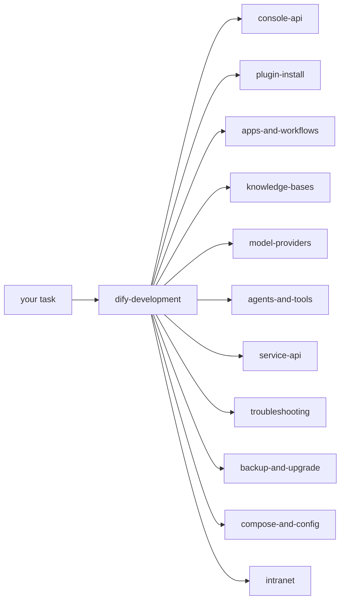
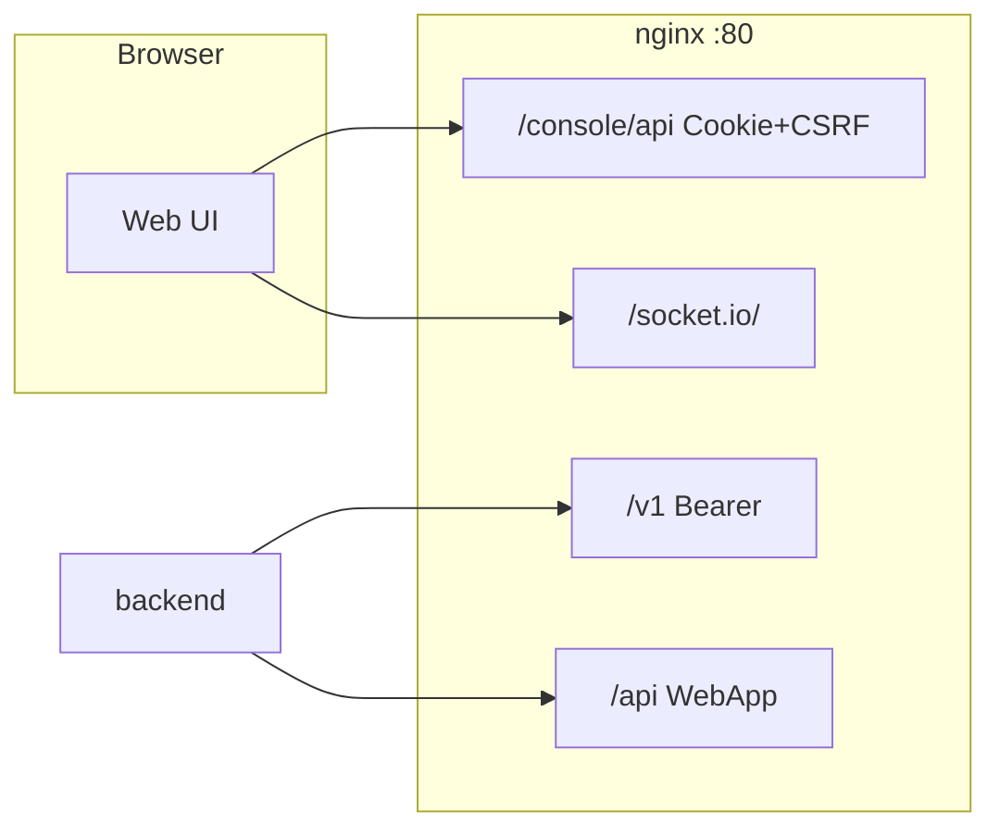

# Dify Operating Skills

[](https://github.com/langgenius/dify)
[](CHANGELOG.md)
[](LICENSE)
[](https://agentskills.io)

Maintainer · 维护者: [kabishou11](https://github.com/kabishou11) (Zhu Lei)

这套 [Agent Skills](https://agentskills.io)（`SKILL.md`）用来操作自托管 **[Dify](https://github.com/langgenius/dify) Community 1.17**：真实 HTTP、鉴权、payload、失败模式。助手按菜单做，不要自己编路由。`main` 跟踪最新 1.17；冻结 Release `v1.17.0` 还没有打。可导入的 zip 在 [`dist/`](dist/) 和预发布 `dify-1.17.0-skills-preview`。

These [Agent Skills](https://agentskills.io) operate self-hosted [Dify](https://github.com/langgenius/dify) Community 1.17. They are runbooks for coding agents — **not** a substitute for in-app [workspace Skills](https://docs.dify.ai/en/self-host/use-dify/build/skills). Zips in [`dist/`](dist/) and the pre-release can be **Imported** on the Dify Skills page as drafts, then published.

Official docs · 官方文档: [langgenius/dify](https://github.com/langgenius/dify) · [Skills](https://docs.dify.ai/en/self-host/use-dify/build/skills)

---

## What this is · 这是什么

本仓库是给编码助手用的 **运维手册**，不是 Dify 控制台里给 *Dify Agent* 用的工作区 Skills。控制台那套要在 Skills 页 Import / 发布；这套是 `skills/<name>/SKILL.md`，装进 Agent Skills 目录后按 description 加载。

This repo is **not** in-app workspace Skills. Those live in the Dify console. These folders *can* be zipped (`SKILL.md` at the archive root) and imported there if you want the same checklist inside a Dify Agent — the Agent still needs HTTP / code tools to execute the requests.

从 [dify-development](skills/dify-development/SKILL.md) 进。助手只预加载 `name` + `description`，匹配上了才读全文。

Start at [dify-development](skills/dify-development/SKILL.md). Assistants load `name` + `description` first; they read the body only on a match.



---

## Problem map · 现象对照

Self-hosted Dify failures are usually **prefix, auth, compose injection, canvas DSL, or Service API `user` scope** — not the wrong button. 自托管的坑多半在这些，而不在点哪个按钮。

| Symptom / 现象 | Why / 原因 | Skill |
| --- | --- | --- |
| 登录 `401 Invalid encrypted data` | 密码要 **Base64**，不是 RSA / 明文 | [dify-console-api](skills/dify-console-api/SKILL.md) |
| `401 CSRF` / 一小时后又挂 | Cookie 没有 `X-CSRF-Token`（**GET 也要**），或 session 过期 | [dify-console-api](skills/dify-console-api/SKILL.md) |
| 登录后首页 307 | 1.17 未登录跳 `/signin`，不是装坏了 | [dify-console-api](skills/dify-console-api/SKILL.md) |
| Web SSR “Server console API URL is not configured” | web 缺 `SERVER_CONSOLE_API_URL=http://api:5001` | [dify-compose-and-config](skills/dify-compose-and-config/SKILL.md) |
| nginx 502 `host not found in upstream api_websocket` | websocket 停着就 reload 了 nginx | [dify-troubleshooting](skills/dify-troubleshooting/SKILL.md) |
| `GET /apps` 少了一个 Agent | Agent Studio 在 `GET /agent` | [dify-console-api](skills/dify-console-api/SKILL.md) |
| 改了画布演示还是旧图 | `/v1` 跑的是 **published** | [dify-apps-and-workflows](skills/dify-apps-and-workflows/SKILL.md) |
| 文本 PDF 应用画布上还有 OCR | 文本版和 OCR 版必须拆成两个应用 | [dify-apps-and-workflows](skills/dify-apps-and-workflows/SKILL.md) |
| 改了 `.env` 容器里看不到 | 运行态才是真相：官方 1.17 走 `env_file`；定制 compose 常 **列出** `environment:` 或 bind-mount nginx/squid | [dify-compose-and-config](skills/dify-compose-and-config/SKILL.md) |
| 新盒子要「调到最佳」 | 平台 compose/超时/上传/SSRF/worker，**不是**导入自建工具 | [dify-development](skills/dify-development/SKILL.md) 「新环境：Dify 平台基础配置」 |
| 长工作流 6 分钟被杀 | `GUNICORN_TIMEOUT` 仍 **360**，或 nginx 3600s | [dify-compose-and-config](skills/dify-compose-and-config/SKILL.md) |
| Celery 把 CPU 打满、模型变慢 | `CELERY_AUTO_SCALE` 未注入 `MAX_WORKERS`，扩到 nproc | [dify-compose-and-config](skills/dify-compose-and-config/SKILL.md) |
| 上传 PDF 413 | nginx `client_max_body_size` 小于 Dify `UPLOAD_*` | [dify-compose-and-config](skills/dify-compose-and-config/SKILL.md) |
| 重建 api 后 nginx `502` | 上游 IP 缓存，要 `nginx -s reload` | [dify-troubleshooting](skills/dify-troubleshooting/SKILL.md) |
| 画布一直「同步数据中」 | 1.16+ 走 Socket.IO `/socket.io/`，`NEXT_PUBLIC_SOCKET_URL` 必须浏览器能访问 | [dify-troubleshooting](skills/dify-troubleshooting/SKILL.md) |
| `POST .../workflows/draft` 400 `environment_variables extra_forbidden` | 1.17 图同步不再收顶层 env 列表 | [dify-apps-and-workflows](skills/dify-apps-and-workflows/SKILL.md) |
| React error #130 | DSL 节点缺顶层 `type: "custom"` | [dify-apps-and-workflows](skills/dify-apps-and-workflows/SKILL.md) |
| `Invalid upload file` | `/v1` 上传和运行必须同一 API key + 同一稳定 `user` | [dify-service-api](skills/dify-service-api/SKILL.md) |
| 外挂知识库 404 / 召回全被滤掉 | RAGFlow 端点要带 `/dify`；那条路径没有 rerank，阈值要关 | [dify-knowledge-bases](skills/dify-knowledge-bases/SKILL.md) |
| 插件 uv `exit status 1` | 容器没外网，要用 host `.difypkg` + 本地 PEP 503 | [dify-plugin-install](skills/dify-plugin-install/SKILL.md) |
| 插件列表有名字但仍不可用 | 要以 daemon 为准，还要 **local runtime ready** | [dify-plugin-install](skills/dify-plugin-install/SKILL.md) |
| 工具 `Unknown error` | `tool_name` 必须是 OpenAPI `operationId`，不是显示名 | [dify-agents-and-tools](skills/dify-agents-and-tools/SKILL.md) |
| 每个图都拖 MinerU / OCR 空结果 | 应做成可复用 Workflow 再发布为工具；插件不轮询异步 `/file_parse` | [dify-agents-and-tools](skills/dify-agents-and-tools/SKILL.md) |
| Webhook 404 / 定时不跑 | 公网路径是 `/triggers/webhook/{id}`；schedule 靠 worker_beat poller | [dify-apps-and-workflows](skills/dify-apps-and-workflows/SKILL.md) |
| 文件 start 上加了定时节点 publish 失败 | `start` 与 Trigger 不能同图；解析和每日扫描拆两个应用 | [dify-apps-and-workflows](skills/dify-apps-and-workflows/SKILL.md) |
| `/rbac` `/billing` 403 | 社区版功能开关，不是 CSRF 坏了 | [dify-development](skills/dify-development/SKILL.md) |
| 内网 HTTP / RAGFlow 502 | Squid SSRF，把内网主机加进 `NO_PROXY`；`SSRF_PROXY_ALLOW_PRIVATE_IPS` 是 CIDR 不是 `true` | [dify-intranet](skills/dify-intranet/SKILL.md) |
| 改了 `.env` 画布 Loop 上限不变 | 1.17 要 recreate **web**；运行时限额在 api `WORKFLOW_MAX_*` | [dify-compose-and-config](skills/dify-compose-and-config/SKILL.md) |
| 邀请邮件发不出去 | Dify 自己的 `MAIL_TYPE=smtp`，不是 email 插件 | [dify-compose-and-config](skills/dify-compose-and-config/SKILL.md) |
| 代码节点 15s 被杀 | `SANDBOX_WORKER_TIMEOUT`，不是「sleep ≤ 2s」 | [dify-apps-and-workflows](skills/dify-apps-and-workflows/SKILL.md) |
| 知识库 hit-test 空 | 外挂要 `/dify`；rerank 四个字段；关 score_threshold | [dify-knowledge-bases](skills/dify-knowledge-bases/SKILL.md) |

---

## Import into Dify · 导入到 Dify

要把检查清单放进 Dify Agent：每个 `skills/<name>/` 打成 zip，**`SKILL.md` 必须在压缩包根目录**。在 Dify 1.17 **Skills** 页 **Import** `.zip` / `.skill` → 草稿 → 审阅后再 Publish。不要把含密码或 `SECRET_KEY` 的本地副本传上去。

Zip each `skills/<name>/` with `SKILL.md` at the archive root. On the Dify 1.17 Skills page: **Import** `.zip` / `.skill` (default 50 MB, `UPLOAD_SKILL_FILE_SIZE_LIMIT`). Imports land as **drafts**; publish after review. A Dify Agent still needs HTTP / code tools to run these runbooks.

默认四份（[`dist/`](dist/) 或预发布附件）：

| Package | Why import it · 适合当检查清单 |
| --- | --- |
| `dist/dify-troubleshooting.zip` | Hang / 挂了先按症状分层 |
| `dist/dify-compose-and-config.zip` | compose / `.env` / nginx knobs |
| `dist/dify-plugin-install.zip` | Marketplace / 离线 `.difypkg` / uv |
| `dist/dify-console-api.zip` | Login, CSRF, console routes（外部 curl 对照表） |

```bash
python3 scripts/package-dify-workspace.py          # default four → dist/*.zip
python3 scripts/package-dify-workspace.py --all
python3 scripts/package-dify-workspace.py --format skill
# manual: ( cd skills/dify-troubleshooting && zip -r ../../dist/dify-troubleshooting.zip SKILL.md )
```

---

## Install · 安装

装进兼容 [Agent Skills](https://agentskills.io) 的目录。要进 **Dify 工作区** 用上一节 Import，不要把整仓拷进控制台。

Copy `skills/dify-*` into an Agent Skills root. For the Dify workspace, use Import above.

```bash
git clone https://github.com/kabishou11/dify-skills.git
cd dify-skills

./scripts/install.sh user       # ~/.agents/skills
./scripts/install.sh project    # ./.agents/skills   (run from the target repo)
./scripts/install.sh --dest /your/skills/dir
```

同名旧目录会被替换；本仓库源文件不动。Existing folders with the same name are replaced; this repo is unchanged.

```bash
mkdir -p ~/.agents/skills
cp -R skills/dify-* ~/.agents/skills/
```

装好后用 `/dify-development` 试一次。看不到就重启助手。Then invoke `/dify-development`. Restart the assistant if skills do not appear.

---

## How to use · 怎么用

1. **先分流 / route first.** 任何 Dify 任务先 `/dify-development`。不要让模型猜 URL。
2. **实例信息放对话，不要写进技能。** 例如 `DIFY=http://127.0.0.1`、管理员邮箱、compose 目录。密码、`SECRET_KEY`、API Key 只放本地 secrets。
3. **用技能里的 HTTP。** 控制台是 Cookie + `X-CSRF-Token`（1.17 的 GET 也要带）；已发布调用是 `Authorization: Bearer`。
4. **一次做一件。** 登录 → 模型 → 插件 → 知识库 → 应用 → 发布 → `/v1`。画布改完 ≠ 产品可用。

```text
/dify-development
我的 Dify 在 http://127.0.0.1 ，管理员邮箱是 admin@example.com。
先登录，确认 setup 已经 finished，然后列出应用。
```

自然语言同样可以（description 对得上就会加载），例如：内网装插件 → plugin-install + intranet；RAGFlow 召回全 0 → knowledge-bases；长工作流被杀 → compose-and-config。

---

## Skills catalog · 技能目录

Slash name = directory name. 斜杠名 = 目录名。

| Skill | 中文 | English |
| --- | --- | --- |
| [dify-development](skills/dify-development/SKILL.md) | 任何 Dify 工作的入口：分流、硬性规则、新机器开工顺序 | Router: rules, new-box order, which skill to open next |
| [dify-api-catalog](skills/dify-api-catalog/SKILL.md) | `/console/api` `/v1` `/api` `/openapi/v1` MCP inner 鉴权对照 | Which prefix and auth to use |
| [dify-console-api](skills/dify-console-api/SKILL.md) | Base64 登录、cookie、`X-CSRF-Token`、常用 console 路由 | Admin HTTP: login, CSRF, console routes |
| [dify-plugin-install](skills/dify-plugin-install/SKILL.md) | 在线/离线 `.difypkg`、本地 PyPI、uv 失败、runtime ready | Marketplace and offline plugin install |
| [dify-plugin-development](skills/dify-plugin-development/SKILL.md) | 自写 tool / model / agent strategy / endpoint | Packaging and debugging your own plugin |
| [dify-apps-and-workflows](skills/dify-apps-and-workflows/SKILL.md) | 画布、DSL 0.7.0、draft+hash、触发器、sandbox | Apps, DSL, triggers, code-node timeouts |
| [dify-knowledge-bases](skills/dify-knowledge-bases/SKILL.md) | 切片、metadata、hit-test、外挂 RAGFlow `/dify` | Datasets, chunks, hit-test, external RAG |
| [dify-model-providers](skills/dify-model-providers/SKILL.md) | LLM / embedding / rerank / ASR，OpenAI 兼容 | Model providers and credentials |
| [dify-agents-and-tools](skills/dify-agents-and-tools/SKILL.md) | Agent、OpenAPI `operationId`、workflow 当工具 | Agents and three `tool_name` conventions |
| [dify-workspace-extras](skills/dify-workspace-extras/SKILL.md) | 工作区 Skills、Studio、日志/统计、MCP | Workspace extras, logs, Agent Studio |
| [dify-service-api](skills/dify-service-api/SKILL.md) | 已发布 `/v1`、文件对象、`user` 作用域 | Published `/v1` calls and file ACL |
| [dify-intranet](skills/dify-intranet/SKILL.md) | `NO_PROXY`、空 `CONSOLE_API_URL`、关掉 Marketplace | Air-gapped / SSRF allowlists |
| [dify-troubleshooting](skills/dify-troubleshooting/SKILL.md) | 已坏：CSRF、uv、413、SSRF、Socket.IO | Symptom-first debug |
| [dify-backup-and-upgrade](skills/dify-backup-and-upgrade/SKILL.md) | 两套 Postgres、同一把 `SECRET_KEY`、滚动升级 | Backup, migrate, rolling upgrade |
| [dify-compose-and-config](skills/dify-compose-and-config/SKILL.md) | compose / `.env` / nginx 旋钮；gunicorn 360 | Compose, env injection, timeouts, workers |

```
dify-skills/
├── skills/dify-*/SKILL.md
├── dist/                          # Import zips (SKILL.md at zip root)
├── scripts/install.sh             # user | project | --dest
├── scripts/package-dify-workspace.py
├── scripts/check-skills.py
├── VERSION
├── CHANGELOG.md
└── README.md
```

HTTP 面 / HTTP map:



---

## Versioning · 版本策略

| Where / 位置 | Meaning / 含义 |
| --- | --- |
| [`VERSION`](VERSION) | 这份树对准的 Dify 版本、是否冻结 |
| `main` | Latest Dify. Still changing. |
| Pre-release `dify-1.17.0-skills-preview` | Importable zips. **Not** a freeze. |
| Release `vX.Y.Z` | Frozen snapshot for Dify `X.Y.Z` |

版本号跟 Dify 走，不跟本仓库 SemVer 走。一条 Dify 线冻结时才打稳定 Release。**现在不要打 `v1.17.0`。** 对照 `api/controllers` 写成；社区版按官方 env，不伪装 Enterprise。

Version numbers follow Dify. Do not treat `main` as a published contract. Community edition stays community.

---

## Contributing · 贡献

先开 [issue](https://github.com/kabishou11/dify-skills/issues)，再发 PR。1.17 HTTP / compose / `.env` 必须对照目标机器，不要猜路由。现场验证后再泛化：密钥、内网主机、业务 UUID 不要进 git。跑 `python3 scripts/check-skills.py`；若动了默认可导入的四份技能，再跑 `python3 scripts/package-dify-workspace.py`。

Open an issue first, then a PR. Field-test on a real 1.17 box, then generalize. Details: [CONTRIBUTING](CONTRIBUTING.md).

Hard rules · 稳定约定: 不编造路由；`/console/api` vs `/v1` 分清；密码 Base64；插件看 **runtime ready**；内网优先；不要设 `DEPLOYMENT_EDITION=ENTERPRISE`。

---

## Security · 安全

不要在技能、issue、截图里放：管理员密码、`SECRET_KEY`、应用/数据集 API Key、内网 IP、业务 UUID、聊天分享 token。把它们放在部署机器的 secrets 或环境变量里，只把**变量名**告诉助手。

Do not commit secrets. Name the variables; keep the values off git.

---

## Acknowledgements · 致谢

- **[Dify](https://github.com/langgenius/dify)** / [LangGenius](https://github.com/langgenius) — 开源 LLM 应用平台。本仓库是社区侧操作技能，不是官方文档，也不代表 Dify 团队。
- **[Agent Skills](https://agentskills.io)** — `SKILL.md` 开放规范。
- Operators who hit CSRF, compose injection, Socket.IO, file ACL, and offline packs on real boxes.

Dify is a trademark of LangGenius. MIT license: [LICENSE](LICENSE).
